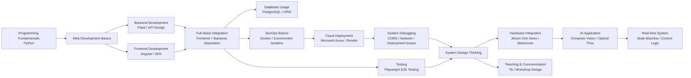
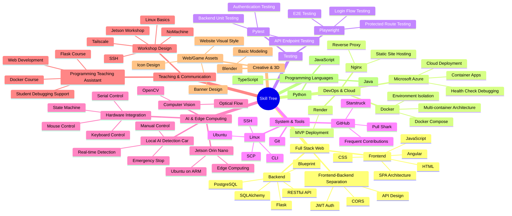

# 個人簡介

鄭兆崴(Jerry Zheng)

資訊數學背景，具備全端開發與系統整合能力，熟悉前後端分離架構、容器化部署與雲端服務。  
擁有程式設計教學經驗，能將抽象概念轉化為實作流程。  
目前專注於軟硬體整合與邊緣運算應用，開發 AI 本地偵測系統。

## 技能流程圖

---

# 技術能力

## 後端
- Flask（RESTful API 開發）
- Blueprint 模組化架構
- 非同步處理概念（Redis / 任務佇列）

## 前端
- Angular（SPA 單頁應用）
- 前後端分離架構
- HTML / CSS / JavaScript

## DevOps / 雲端
- Docker（多容器架構、環境隔離）
- Microsoft Azure（Container Apps 部署）
- Nginx（Reverse Proxy）

## 測試
- Playwright（End-to-End 測試）

## 系統與工具
- Linux（Ubuntu）
- SSH / SCP / CLI 操作
- Git & GitHub（高頻率開發與版本控管）

## 軟硬體整合 / AI
- Jetson Orin Nano（邊緣運算）
- Python 硬體控制（Serial 通訊）
- 狀態機設計（即時控制系統）
- 基礎電腦視覺（Optical Flow）

## 其他
- Blender（3D 建模）
- Java（基礎）

---

# 專案經驗

## 全端網站系統（Angular + Flask）
- 建立前後端分離架構（SPA + REST API）
- 使用 Docker 建立多服務系統（Frontend / Backend / Database）
- 使用 Nginx 實作反向代理
- 部署至 Microsoft Azure（Container Apps）
- 整合使用者系統、資料顯示與 API 串接

Repo:
https://github.com/Jerry-ya-ya/JackAndBeanstalks.git

---

## AI 邊緣運算自走車（開發中）
- 使用 Jetson Orin Nano 作為運算核心
- 整合電腦視覺與硬體控制（USB / Serial）
- 建立狀態機控制車輛行為（前進 / 停止 / 緊急控制）
- 實作即時影像處理（Optical Flow）
- 支援鍵盤 / 滑鼠控制與自動化行為切換

Repo:
https://github.com/Jerry-ya-ya/JetsonOrinNano.git

demo:
[Waverover_bind_JetsonOrinNano](/doc/jetson_orin_nano_ai_car/waverover.mov)

---

# 教學經驗

## 程式設計教學助理
- 協助教授進行程式設計課程（Flask / Docker / Web Development）
- 設計實作導向教學內容
- 指導學生建立完整專案（從環境建置到部署）
- 協助學生除錯與系統設計理解

### 聘任證明
[聘任證明](/page/teaching_assistant/certification_of_employment.md)

### 20260326 助教課
[20260326助教課紀錄](/page/teaching_assistant/20260326.md)

### 20260430 助教課
[20260430助教課紀錄](/page/teaching_assistant/20260430.md)

## 開設台灣工業與應用數學會贊助之工作坊

### 20260428 工作坊
[20260428工作坊紀錄](/page/workshop/20260428.md)

### 20260504 工作坊
[20260504工作坊紀錄](/page/workshop/20260504.md)

---

# 附加成就

- AI900證照[AI900_Certificate](/page/certification/AI900.md)
- GitHub Achievement: **Quickdraw** (2026/06/26)
- GitHub Achievement: **Starstruck** (2026/03/05)
- GitHub Achievement: **Pull Shark** (2025/06/26)

---

# GitHub 活躍度

[GitHub活躍度紀錄](/page/github/contribution.md)

---

