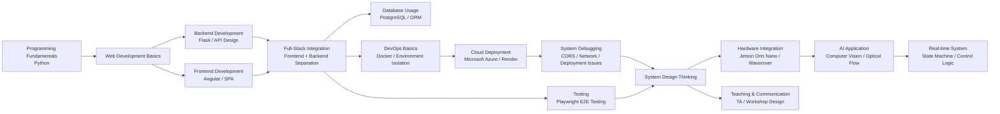
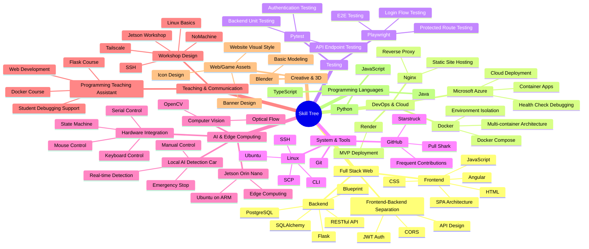

# Jerry Zheng

Full-Stack Developer / Edge Computing Enthusiast

[English](/README.md)(Current) | [繁體中文](/README_zh-TW.md)

# Professional Summary

Background in Information Mathematics with experience in full-stack development and system integration. Familiar with frontend-backend separation architecture, containerized deployment, and cloud services.
Experienced in programming instruction and capable of transforming abstract concepts into practical implementation workflows.
Currently focusing on hardware-software integration and edge computing applications, developing local AI detection systems.

## Skill Flowchart

---

# Technical Skills

## Backend
- Flask (RESTful API Development)
- Blueprint Modular Architecture
- Asynchronous Processing Concepts (Redis / Task Queue)

## Frontend
- Angular (SPA Single Page Application)
- Frontend-Backend Separation Architecture
- HTML / CSS / JavaScript

## DevOps / Cloud
- Docker (Multi-container Architecture, Environment Isolation)
- Microsoft Azure (Container Apps Deployment)
- Nginx（Reverse Proxy）

## Testing
- Playwright (End-to-End Testing)
- Pytest (Backend API Testing)

## Systems & Tools
- Linux（Ubuntu）
- SSH / SCP / CLI Operations
- Git & GitHub (Frequent Development and Version Control)

## Hardware Integration / AI
- Jetson Orin Nano (Edge Computing)
- Python Hardware Control (Serial Communication)
- State Machine Design (Real-time Control Systems)
- Basic Computer Vision (Optical Flow)

## Others
- Blender (3D Modeling)
- Java (Basic)

---

# Project Experience

## Full-Stack Web Platform (Angular + Flask)
- Built a frontend-backend separated architecture (SPA + REST API)
- Used Docker to establish a multi-service system (Frontend / Backend / Database)
- Implemented reverse proxy with Nginx
- Deployed to Microsoft Azure (Container Apps)
- Integrated user systems, data presentation, and API communication

Repo:
https://github.com/Jerry-ya-ya/JackAndBeanstalks.git

---

## AI Edge Computing Autonomous Vehicle (In Development)
- Used Jetson Orin Nano as the computing core
- Integrated computer vision and hardware control (USB / Serial)
- Built a state machine to control vehicle behavior (Forward / Stop / Emergency Control)
- Implemented real-time image processing (Optical Flow)
- Supported keyboard / mouse control and automated behavior switching

Repo:
https://github.com/Jerry-ya-ya/JetsonOrinNano.git

demo:
[Waverover_bind_JetsonOrinNano](/doc/jetson_orin_nano_ai_car/waverover.mov)

---

# Teaching Experience

## Programming Teaching Assistant
- Assisted professors in programming-related courses (Flask / Docker / Web Development)
- Designed implementation-oriented teaching materials
- Guided students in building complete projects (from environment setup to deployment)
- Assisted students with debugging and system design understanding

### Employment Certification
[Employment Certification](/page_en/teaching_assistant/certification_of_employment.md)

### 20260326 TA Session
[20260326 TA Session Record](/page_en/teaching_assistant/20260326.md)

### 20260430 TA Session
[20260430 TA Session Record](/page_en/teaching_assistant/20260430.md)

## Workshop Sponsored by the Taiwan Society of Industrial and Applied Mathematics

### 20260428 Workshop
[20260428 Workshop Record](/page_en/workshop/20260428.md)

### 20260504 Workshop
[20260504 Workshop Record](/page_en/workshop/20260504.md)

---

# Additional Achievements

- [Microsoft_AI900_Certification](/page_en/certification/AI900.md)(2024/11/07)
- GitHub Achievement: **Pull Shark** (2025/06/26)
- GitHub Achievement: **Starstruck** (2026/03/05)
- GitHub Achievement: **Quickdraw** (2026/06/26)

---

# GitHub Activity

[GitHub Contribution Record](/page_en/github/contribution.md)

---

# Personal statement

I first became interested in computer-related technologies during junior high school. At that time, one of my classmates introduced me to the Windows CMD command-line interface, and I found it fascinating that computers could be controlled through commands. This experience sparked my interest in the field of information technology. During high school, I participated in a self-directed learning program where a teacher demonstrated a YOLO object detection project through Google Colab. It was my first exposure to artificial intelligence and practical software applications, and I also began learning the fundamentals of programming. Afterward, I started focusing on Python and Flask to gradually build my backend development foundation.

After entering university, I attended an Angular course originally opened for second-year students by my academic advisor during my freshman year. This experience introduced me to frontend-backend separation architecture and led me toward full-stack development. Beyond implementing features, I gradually learned the importance of system architecture, deployment, and cross-environment integration. My primary project is a community platform developed with a separated frontend-backend architecture. The system includes administrator and user systems, post publishing functionality, and scheduled web crawlers that automatically fetch and integrate news content into the website. The entire system, including frontend, backend, database, and deployment, was independently developed by myself. I also successfully completed my first university-level project during freshman year and have continued maintaining and improving it ever since.

Throughout the project development process, I found that the most challenging part was not writing the program itself, but deployment and environment integration. During my first deployment to Microsoft Azure, the system contained multiple Docker containers, requiring configuration for frontend-backend communication, database connections, cross-container networking, and cloud environment issues. One major issue occurred because my backend lacked a health check API (Heartbeat API), causing the service to fail repeatedly. I spent nearly an entire week continuously debugging and adjusting configurations before successfully solving the problem. This experience deeply taught me that software engineering is not only about writing code, but also about ensuring that multiple services can operate together reliably and stably.

In addition to full-stack development, I have also started exploring hardware-software integration projects, including Jetson Orin Nano and Waverover edge computing autonomous vehicle systems. Through these experiences, I gradually realized that current AI tools still struggle to fully replace practical engineering abilities such as cross-service integration, deployment, and hardware communication. This further strengthened my determination to continue developing in both full-stack engineering and hardware-software integration.

Currently, I also assist junior students in building their own website projects. Beyond sharing technical knowledge, this experience has gradually strengthened my abilities in project planning and technical decision-making. One of my proudest achievements was successfully deploying my project to the Azure public cloud environment, allowing the website to be accessed globally. Additionally, through PWA technology, the website can be installed and used on iPhone devices with an experience similar to native mobile applications. Although I still have many areas to improve, I hope to continue gaining practical experience and become an engineer capable of balancing system architecture, deployment capability, and user experience.

---

