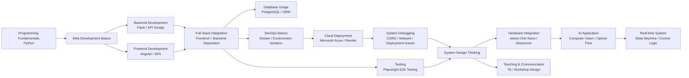
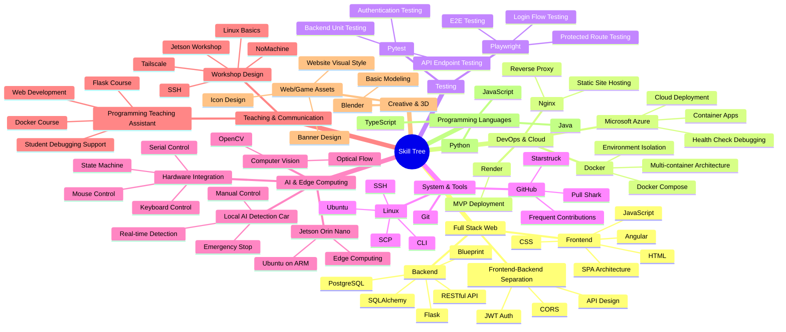

# 鄭兆崴(Jerry Zheng)

全端開發者 / 邊緣運算開發者

[English](/README.md) | [繁體中文](/README_zh-TW.md)(Current)

# 個人摘要

資訊數學背景，具備全端開發與系統整合能力，熟悉前後端分離架構、容器化部署與雲端服務。  
擁有程式設計教學經驗，能將抽象概念轉化為實作流程。
目前專注於軟硬體整合與邊緣運算應用，開發 AI 本地偵測系統。

## 技能流程圖

---

# 技術能力

## 後端
- Flask（RESTful API 開發）
- Blueprint 模組化架構
- 非同步處理概念（Redis / 任務佇列）

## 前端
- Angular（SPA 單頁應用）
- 前後端分離架構
- HTML / CSS / JavaScript

## DevOps / 雲端
- Docker（多容器架構、環境隔離）
- Microsoft Azure（Container Apps 部署）
- Nginx（Reverse Proxy）

## 測試
- Playwright（End-to-End 測試）
- Pytest（後端 API 測試）

## 系統與工具
- Linux（Ubuntu）
- SSH / SCP / CLI 操作
- Git & GitHub（高頻率開發與版本控管）

## 軟硬體整合 / AI
- Jetson Orin Nano（邊緣運算）
- Python 硬體控制（Serial 通訊）
- 狀態機設計（即時控制系統）
- 基礎電腦視覺（Optical Flow）

## 其他
- Blender（3D 建模）
- Java（基礎）

---

# 專案經驗

## 全端網站系統（Angular + Flask）
- 建立前後端分離架構（SPA + REST API）
- 使用 Docker 建立多服務系統（Frontend / Backend / Database）
- 使用 Nginx 實作反向代理
- 部署至 Microsoft Azure（Container Apps）
- 整合使用者系統、資料顯示與 API 串接

Repo:
https://github.com/Jerry-ya-ya/JackAndBeanstalks.git

---

## AI 邊緣運算自走車（開發中）
- 使用 Jetson Orin Nano 作為運算核心
- 整合電腦視覺與硬體控制（USB / Serial）
- 建立狀態機控制車輛行為（前進 / 停止 / 緊急控制）
- 實作即時影像處理（Optical Flow）
- 支援鍵盤 / 滑鼠控制與自動化行為切換

Repo:
https://github.com/Jerry-ya-ya/JetsonOrinNano.git

demo:
[Waverover_bind_JetsonOrinNano](/doc/jetson_orin_nano_ai_car/waverover.mov)

---

# 教學經驗

## 程式設計教學助理
- 協助教授進行程式設計課程（Flask / Docker / Web Development）
- 設計實作導向教學內容
- 指導學生建立完整專案（從環境建置到部署）
- 協助學生除錯與系統設計理解

### 聘任證明
[聘任證明](/page_zh-TW/teaching_assistant/certification_of_employment.md)

### 20260326 助教課
[20260326助教課紀錄](/page_zh-TW/teaching_assistant/20260326.md)

### 20260430 助教課
[20260430助教課紀錄](/page_zh-TW/teaching_assistant/20260430.md)

## 開設台灣工業與應用數學會贊助之工作坊

### 20260428 工作坊
[20260428工作坊紀錄](/page_zh-TW/workshop/20260428.md)

### 20260504 工作坊
[20260504工作坊紀錄](/page_zh-TW/workshop/20260504.md)

---

# 附加成就

- [微軟AI900證照](/page_zh-TW/certification/AI900.md)(2024/11/07)
- GitHub 成就: **Pull Shark** (2025/06/26)
- GitHub 成就: **Starstruck** (2026/03/05)
- GitHub 成就: **Quickdraw** (2026/06/26)

---

# GitHub 活躍度

[GitHub活躍度紀錄](/page_zh-TW/github/contribution.md)

---

# 自傳

我從國中時期開始接觸電腦相關技術，當時在同儕的分享下第一次使用 Windows CMD 指令介面，對於能夠透過指令操作電腦感到十分新奇，也因此開始對資訊領域產生興趣。到了高中階段，因參與自主學習活動，老師透過 Google Colab 展示 YOLO 物件辨識專案，讓我首次接觸到人工智慧與程式實際應用的概念，同時也開始接觸基礎程式設計課程。之後我以 Python 與 Flask 作為主要學習方向，逐步建立後端開發基礎。

進入大學後，大一時在旁聽班導為二年級開設的 Angular 課程時，我開始接觸前後端分離架構，並逐漸朝全端開發方向深入學習。過程中除了功能實作外，也開始理解系統架構、部署與跨環境整合的重要性。我的主要專案是一套以前後端分離架構開發的社群網站，具備管理員與使用者系統、文章發佈功能，以及定時爬蟲自動擷取新聞內容並整合至網站中的功能。整個系統從前端、後端、資料庫到部署皆由我獨立完成，也成功在大一下完成大學的第一個專案，至今也一直在更新。

在專案開發過程中，我認為最具挑戰性的部分並非程式功能本身，而是實際部署與環境整合。第一次將專案部署至 Microsoft Azure 時，由於系統包含多個 Docker 容器，需要處理前後端溝通、資料庫連線、跨容器設定與雲端環境問題。我曾因後端缺少健康檢查 API（Heartbeat API）而導致服務無法正常運作，並花費將近一週時間不斷調整設定與除錯。這段經驗讓我深刻理解，軟體工程不只是撰寫程式，更重要的是如何讓各項服務能穩定地整合與運行。

目前除了持續進行全端開發外，我也開始接觸軟硬整合相關技術，例如 Jetson Orin Nano 與 Waverover 等邊緣運算與自走車控制專案。透過這些經驗，我逐漸理解目前 AI 工具仍難以完全取代跨服務整合、系統部署與硬體溝通等實務工程能力，也讓我更加確立未來希望朝全端開發與軟硬整合方向發展。

此外，我目前也有協助指導學弟妹建立自己的網站專案，過程中除了分享技術經驗外，也逐漸培養自己在專案規劃與技術決策上的能力。我認為自己最大的成就之一，是成功將專案部署至 Azure 公網環境，讓網站能夠被世界各地存取，並透過 PWA 技術讓網站可以在 iPhone 上以接近原生 App 的形式運作。雖然目前仍有許多需要持續精進的地方，但我希望未來能持續累積實務經驗，成為能兼顧系統架構、部署能力與使用者體驗的工程師。

---

